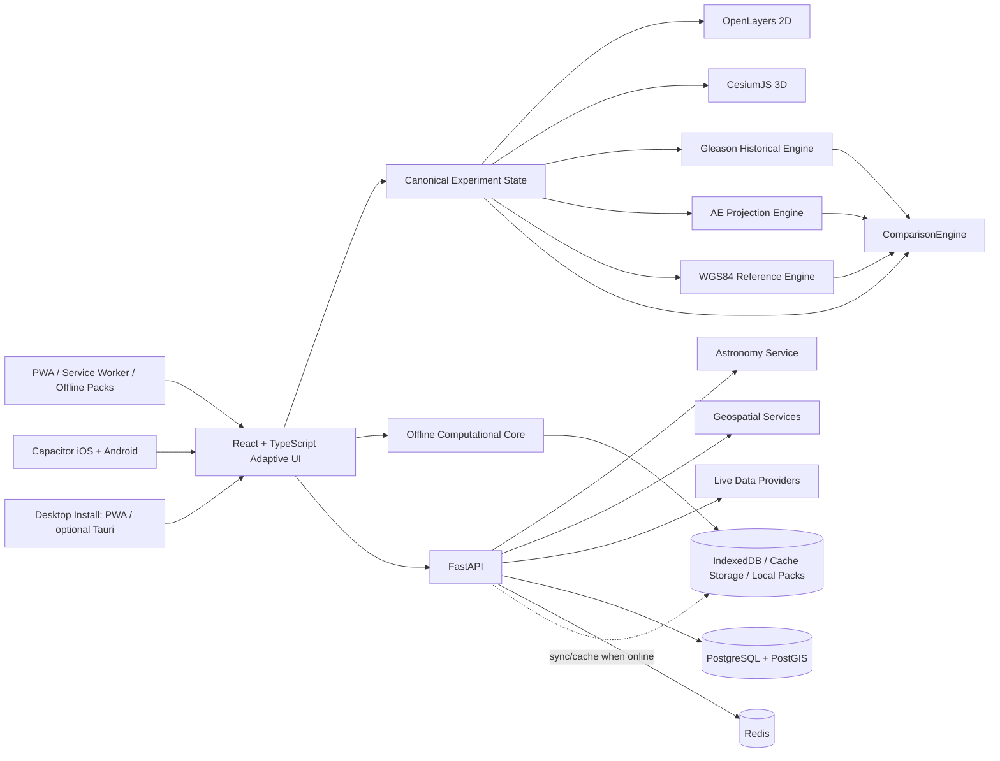

# PROJECT ARCHITECTURE

## منصة المقارنة الجغرافية والفلكية بين خريطة ألكسندر جليسون والنموذج الكروي

**Architecture Revision:** 0.2.0  
**Phase:** 0 — Analysis & Architecture  
**Target release after Phase 1:** v0.1.0  
**Status:** Phase 0 accepted baseline, revised for three-model comparison, cross-platform delivery, and offline-first core — no production feature implementation yet  
**Date:** 2026-09-09

---

## 1. Executive Summary

هذا المشروع سيُبنى كمنصة Web مستقلة الواجهة عن المنطق الحسابي ومصادر البيانات. الهدف المركزي هو جعل كل نتيجة قابلة للتتبع إلى:

1. **النموذج/الإسقاط المستخدم**.
2. **المعادلة أو الخوارزمية**.
3. **مرجع الإحداثيات**.
4. **مصدر البيانات**.
5. **زمن/إصدار البيانات**.
6. **درجة الدقة أو القيود**.

سيكون هناك **ثلاثة محركات تمثيل/حساب مستقلة** بدل دمج الخريطة المسطحة في مفهوم واحد:

- **Gleason Historical Model:** إعادة بناء قابلة للتتبع لما يمكن إثباته من كتاب ألكسندر جليسون، مع تصنيف كل قاعدة إلى `Documented` أو `Derived` أو `Assumed`.
- **AE Visualization Model:** إسقاط Azimuthal Equidistant مستقل، للاستفادة من النمط البصري الشائع في تطبيقات مشابهة دون نسبته تلقائيًا إلى جليسون.
- **WGS84 Reference Model:** النموذج الجيوديسي الحديث للكرة/الإهليلج والمرجع المشترك للبيانات الجغرافية الحديثة.

المحور المشترك بينها هو **Canonical Geographic Coordinate Model**، وليس إحداثيات الشاشة أو البكسلات. وتعود النتائج إلى **ComparisonEngine** مستقل يقارن المسافة والاتجاه والموضع الفلكي والزمن دون أي تطبيع خفي لجعل النتائج متطابقة.

المنتج سيكون **Web-First + Installable + Offline-First**: يعمل في المتصفحات الحديثة على الحاسوب والجوال والتابلت، ويُثبت كتطبيق PWA، مع غلاف Native للجوال عبر Capacitor، وخيار تطبيق سطح مكتب مبني على نفس الواجهة عند الحاجة. الوظائف الأساسية التي لا تحتاج بيانات حية ستظل قابلة للعمل دون اتصال بعد تنزيل حزم البيانات المطلوبة.

---

## 2. نطاق المرحلة 0

هذه الوثيقة هي مخرج المرحلة 0 فقط. لا تُنشئ هذه المرحلة التطبيق الكامل، ولا تعتبر أي طبقة وظيفية منفذة.

تغطي الوثيقة:

- تحليل المتطلبات.
- المعمارية المنطقية والمادية.
- Technology Stack.
- نموذج البيانات.
- API Architecture.
- Data Provider Architecture.
- نموذج المقارنة بين المحركات/التمثيلات الثلاثة.
- استراتيجية الحسابات الجغرافية والفلكية.
- الأمن والأداء.
- الاختبارات.
- مخاطر المشروع.
- خطة الطريق والإصدارات.


## 2.1 القرارات المعتمدة بعد مراجعة تطبيق Flat Earth وموافقة مالك المشروع

تم اعتماد المقترحات التالية كجزء رسمي من Scope المشروع بالكامل:

1. **Model Laboratory** لمقارنة Gleason Historical وAE وWGS84.
2. **Gleason Original Mode** لإعادة بناء القرص الزمني والذراعين الشعاعيين والعناصر التاريخية من المصدر عند ثبوتها.
3. **Scientific Reference Mode** لعرض نتيجة المرجع الفلكي الحديث مقابل نتيجة نموذج جليسون.
4. **Provenance Inspector** لكل رقم وطبقة ومعادلة.
5. **Observation Lab** لإدخال أو استيراد ملاحظة رصد ومقارنة الخطأ بين النماذج.
6. **Ground Truth Validation Suite** بحالات مرجعية عالمية.
7. **Solar/Lunar Inspector** متقدم.
8. **Day/Night Difference Overlay** لمقارنة مناطق الإضاءة بين المحركات.
9. **Civil / Nautical / Astronomical Twilight** بالإضافة إلى الشروق والغروب.
10. **Longitude Laboratory** لمقارنة طول الدرجة والتباعد حسب خط العرض.
11. **Navigation Laboratory**: Geodesic / Great-circle / Rhumb / projected straight line / user track.
12. **Historical Claims Lab** لإعادة اختبار أمثلة الكتاب مع بيانات حديثة مستقلة.
13. **Historical Source Viewer** يربط الميزة بصفحة/شكل/نص المصدر.
14. **Eclipse Prediction vs Visibility Comparison**.
15. **Flight Route Analyzer** باستخدام نقاط ADS-B الفعلية عند توفرها.
16. **Submarine Cable Analyzer**.
17. **Elevation Profile** للمسارات.
18. **River Longitudinal Profile** واتجاه الجريان.
19. **Historical Map Georeferencing** مع مقارنة Scan/Vector.
20. **High-resolution Screenshot / Video Export** مع Presets منها 9:16.
21. **Shareable Experiment URL**.
22. **Experiment Notebook** للحفظ والتعليقات والتصدير.
23. **Reproducibility ID** لكل تجربة/نتيجة قابلة للإعادة.
24. **Data Quality Badges**.
25. **Offline Core + Downloadable Offline Packs**.
26. **Arabic/English First-Class i18n** مع RTL/LTR.
27. **Presentation Mode / Research Mode**.
28. **No Hidden Normalization**: لا تعدّل النتائج لتتوافق بين النماذج.
29. **Cross-platform delivery**: متصفح + PWA + iOS/Android wrapper + desktop installability.
30. **Responsive/adaptive UX** من الهاتف الصغير إلى الشاشات العريضة.

### تطبيق Flat Earth كمرجع UX لا كمرجع علمي

يُستخدم تطبيق **Flat Earth / Flat Earth Pro من OProjects** كمرجع Benchmark لتجربة المستخدم وبعض الأفكار البصرية مثل التحكم الزمني، مواضع الشمس والقمر، الليل والنهار، البوصلة وبيانات Altitude/Azimuth. لا تُستورد منه معادلات أو نتائج بوصفها مرجعًا علميًا ما لم تكن موثقة وقابلة للتحقق بصورة مستقلة.

---

## 3. ملاحظات المصدر الخاص بألكسندر جليسون

### 3.1 حالة المصدر

أصبحت نسخة الكتاب المطلوبة متاحة ضمن ملفات المشروع أثناء هذه المراجعة:

- **File:** `Alex Gleason - Is the Bible From Heaven.pdf`
- **Format:** PDF
- **Parsed pages:** 432 صفحة في النسخة المرفوعة.
- **الطبعة الظاهرة:** Second Edition, revised and enlarged.
- **التاريخ الظاهر في الصفحات التمهيدية:** copyright 1890، مع إعادة كتابة/مراجعة وتوسعة في 1893.
- **SHA-256 للنسخة المرفوعة:** `03e429285376c7fcd21659116f43a8da7d6e363169e7c7841c9b31518effbe60`

توضح صفحة المحتويات أن القسم الثاني يبدأ بالفصل الثالث عشر، وأن الفصول XIII–XIX هي الأكثر ارتباطًا مباشرة بمحرك الخريطة والتمثيل الهندسي/الفلكي، بما فيها: شكل الأرض، الانحناء، الشروق والغروب، حركة الشمس، ارتفاع الشمس، مسار الشمس، Polaris، الملاحة، الزمن وخطوط الطول، المنظور ونقاط التلاشي، الكسوفات، الأنهار، وفروق درجات الطول شمال وجنوب خط الاستواء.

### 3.2 نتائج الدراسة الأولية المؤثرة معماريًا

الدراسة تثبت أن الكتاب يجمع بين حجج هندسية/جيوديسية، وحجج مرتبطة بالشمس والشروق والغروب وارتفاعها ومسارها، وحجج ملاحية تتعلق بالمسافات والزمن، ومناقشات حول خطوط الطول والكسوفات ومسارات الأنهار. لذلك لن يمثل `GleasonProjectionProvider` مجرد تحويل بصري للصورة، بل سيكون محاطًا بطبقة مستقلة تحفظ القواعد والحسابات المنسوبة إلى الكتاب.

### 3.3 عناصر مصدرية مؤكدة

#### الخريطة والتمثيل

فهرس الكتاب يذكر في الفصل السابع عشر **"A New Map of the World As It Is"**، وفي الفصل التاسع عشر **"Degrees of Longitude, South vs. North of the Equator"**.

#### المسافات والملاحة

ينقل الكتاب بيانات لمسارات بحرية من سجلات سفن وخرائط ملاحية، ويذكر صراحة الفرق بين الميل الجغرافي/البحري والميل الإنجليزي، مع أمثلة course/distance/time. لذلك يجب أن تحمل كل نتيجة قياس داخل التطبيق الوحدة وطريقة الحساب ومصدر الرقم.

كما يقارن المؤلف مسافات Cape of Good Hope وCape Horn وBuenos Ayres ويستعمل درجات طول ومقياسًا عدديًا في حجته؛ هذه ستكون **حالات اختبار مصدرية** وليست مرجعًا تلقائيًا لصحة نموذج حديث.

#### درجات الطول جنوب خط الاستواء

الفصل التاسع عشر يناقش صراحة الادعاء بأن درجات الطول جنوب خط الاستواء تتقارب نحو مركز مشترك عند 90° جنوبًا، ويعرضه ضمن حجته الخاصة بالنموذج المستوي.

كما يقدم المؤلف مثالًا عدديًا لمقارنة 56° من الطول والمسافات بين أفريقيا وأمريكا الجنوبية. ستُخزّن هذه المادة كـ `SOURCE_CLAIM` وتُختبر لاحقًا مقابل نتائج مرجعية مستقلة، لا كقانون مفروض مسبقًا.

#### الشمس وارتفاعها

يتضمن الفصل الرابع عشر مثالًا رصديًا لارتفاع الشمس عند الظهر في Buffalo في 21 سبتمبر 1889، مع قيم رقمية للحدين العلوي والسفلي للشمس. يصلح المثال كـ regression test تاريخي مع الاحتفاظ بالسياق والوحدات.

#### الشروق والغروب والمنظور

الفصل الثالث عشر يناقش Sunrise/Sunset والأفق والمنظور ويعرض رسومًا وتفسيرات بصرية، ولذلك ستفصل البنية بين نموذج فلكي قياسي وبين نموذج ادعاءات جليسون بدل دمجهما في خوارزمية واحدة.

#### الكسوفات

فهرس الكتاب يتضمن نظامًا زمنيًا مفصلًا للكسوفات ودوراتها، مع جداول وأقسام مخصصة للكسوفات الشمسية والقمرية.

#### الأنهار

يستخدم الكتاب Nile وAmazon وMississippi ضمن حجته في الفصل الثامن عشر. لذلك ستبقى هندسة الأنهار ومعلوماتها في Data Provider مستقل، بينما تمثل طريقة استخدام الكتاب لها ضمن `SOURCE_CLAIM`.

### 3.4 الفصل الدلالي الإلزامي

سيستخدم المشروع أربع طبقات:

```text
SOURCE_TEXT
    نص/صفحة/شكل من الكتاب

SOURCE_CLAIM
    قاعدة أو ادعاء منسوب إلى الكتاب

COMPUTED_RESULT
    نتيجة ينتجها كود التطبيق

REFERENCE_RESULT
    نتيجة من بيانات/نموذج مرجعي مستقل
```

وتسجل المقارنة في `ComparisonRecord` مع المصدر، الإصدار، الخوارزمية، الوحدات، الزمن، وعدم اليقين عند توفره.

### 3.5 عقد Projection Engine

لا تثبت المرحلة 0 معادلة واحدة نهائية تحت اسم "إسقاط جليسون". بدلاً من ذلك:

```python
class GleasonProjectionProvider(Protocol):
    def forward(self, latitude: float, longitude: float) -> tuple[float, float]: ...
    def inverse(self, x: float, y: float) -> tuple[float, float]: ...
```

وتُحفظ مواصفات النموذج وإصداراته ونقاط المعايرة والاختبارات المصدرية في `GleasonModelSpec`.

### 3.6 قيود استخراج الخريطة من PDF

إذا كانت الخريطة/الأشكال صورًا ممسوحة ضوئيًا، فلا يعتبر OCR تعريفًا هندسيًا كافيًا. سيتم حفظ مرجع الصفحة/الشكل، وتحديد نقاط تحكم معروفة عند الحاجة، ثم معايرة التحويل مع توثيق الأخطاء والافتراضات.

## 4. تصنيف المتطلبات

### 4.1 Core Platform

- واجهة مقارنة ثنائية.
- حالة مشتركة للموقع/الوقت/المسار/الطبقات.
- نظام إحداثيات موحد.
- نظام بحث.
- نظام طبقات.
- أدوات قياس.

### 4.2 Geospatial

- الدول، المدن، القارات، البحار، المحيطات.
- الأنهار والجبال والارتفاعات.
- المطارات.
- الحدود.
- شبكات خطوط الطول والعرض.
- خطوط السرطان والاستواء والجدي.
- Qibla.
- Compass / azimuth.

### 4.3 Astronomy

- الشمس، القمر، الكواكب.
- النجوم ومجموعات البروج.
- Alt/Az.
- السماء كما يراها الراصد.
- الليل والنهار وTerminator.
- الشروق والغروب.
- الكسوفات والخسوفات.
- محاكاة زمنية.

### 4.4 External Live/Network Data

- الطيران المباشر.
- كابلات الإنترنت البحرية.

### 4.5 Platform Quality

- Caching.
- Rate limiting.
- Logging.
- Observability.
- Tests.
- Docker.
- Documentation.
- Data provenance.

---

## 5. Architectural Principles

### Principle A — Canonical Coordinates First

كل اختيار/مسار/نقطة يمثل أولًا كـ:

```text
GeoPoint
    latitude
    longitude
    optional altitude
    datum=WGS84
```

ثم يتم تحويله للعرض:

```text
GeoPoint -> GleasonProjection -> GleasonScreen
GeoPoint -> WGS84/Globe -> Cesium
```

### Principle B — No Pixel-Based Synchronization

المزامنة لا تعتمد على `(x, y)` في الشاشة. بل تعتمد على إحداثيات جغرافية معيارية ورسالة أحداث موحدة.

### Principle C — Separate Data From Computation

مصدر البيانات لا يعرف كيف تُعرض البيانات، ومحرك الحساب لا يجلب بيانات الإنترنت مباشرة.

### Principle D — Provenance Is First-Class Data

كل نتيجة قابلة للحفظ مع:

- `source_id`
- `source_version`
- `algorithm_id`
- `algorithm_version`
- `reference_frame`
- `timestamp`
- `accuracy/uncertainty` عند توفرها.

### Principle E — Models Do Not Mutate Each Other

خريطة جليسون لا تعيد تعريف بيانات النموذج الكروي، والنموذج الكروي لا يعيد تعريف معادلة جليسون. المقارنة طبقة مستقلة.

---

## 6. High-Level Architecture



### 6.1 Canonical Experiment Model

كل تفاعل مهم يُمثل كـ `ExperimentState` قابل للحفظ والمشاركة:

```text
ExperimentState
  id
  observer / selected points
  time + timezone
  active models [GLEASON, AE, WGS84]
  layers
  routes
  measurements
  astronomy targets
  comparison settings
  source versions
  algorithm versions
  offline-pack versions
```

### 6.2 ComparisonEngine

لا تقوم واجهة 2D أو 3D بحساب الفروق بنفسها. `ComparisonEngine` يستقبل نتائج المحركات ثم ينتج:

```text
DeltaDistance
DeltaBearing
DeltaAzimuth
DeltaAltitude
DeltaRiseSet
DeltaCelestialPosition
DeltaTerminator
ValidationResidual
```

### 6.3 Online vs Offline boundary

**يعمل دون إنترنت بعد تجهيز البيانات محليًا:**

- فتح التطبيق والواجهة.
- خريطة جليسون/AE الأساسية وحزم الخرائط المحملة.
- الإحداثيات والتحويلات والمسطرة الأساسية.
- Qibla والاتجاهات والحسابات الجيوديسية المحلية.
- البحث داخل الحزم الجغرافية المحلية.
- طبقات الدول والمدن الأساسية والحدود المحملة.
- الوقت والمناطق الزمنية المحملة.
- وظائف فلكية محلية ضمن نطاق ephemeris/data pack المثبت.
- تشغيل التجارب المحفوظة وComparison المحلي.
- Notebook وProvenance وSource Viewer للمواد المحملة.

**يحتاج الشبكة بطبيعته أو عند عدم وجود حزمة محلية:**

- الطيران المباشر وبيانات ADS-B الحية.
- أي API مرخص لا يسمح بالتخزين المحلي.
- تحديث الخرائط/البيانات/ephemeris.
- مزامنة حسابات المستخدم عبر الأجهزة.
- تحميل حزم Offline جديدة.
- بعض بيانات الكابلات أو الارتفاعات عالية الدقة إن لم تكن محملة.

---

## 7. Recommended Technology Stack

| Layer | Choice | Rationale |
|---|---|---|
| Backend | **Python + FastAPI** | API-first، typed، OpenAPI، مناسب لخدمات الحساب وETL والخدمات الخارجية. FastAPI يوفر مسارات نشر متعددة ويعتمد على OpenAPI للتوثيق. |
| Frontend | **React + TypeScript** | مكونات قوية، types، مناسب لواجهة أدوات كثيرة وحالة تفاعلية معقدة. |
| Web delivery | **Responsive PWA** | Web-first، قابل للتثبيت، Service Worker، Cache Storage، Offline App Shell. |
| Mobile packaging | **Capacitor** | تغليف نفس تطبيق الويب لتطبيقات iOS/Android مع الوصول إلى APIs أصلية عند الحاجة. |
| Desktop packaging | **Installable PWA أولًا، وTauri 2 اختياري** | PWA يكفي لغالبية الاستخدام؛ Tauri يضاف إذا احتجنا filesystem/native integration أو توزيع متجر مكتبي. |
| Offline client storage | **IndexedDB + Cache Storage + versioned data packs** | تخزين التجارب، الفهارس المحلية، الخرائط وحزم البيانات مع إدارة إصدار ومساحة. |
| Offline compute | **Client-side deterministic core + parity tests** | يمنع توقف الوظائف الأساسية عند غياب FastAPI؛ تطابقه مع نتائج الخادم إلزامي. |
| Build | **Vite** | تطوير سريع وHMR وTypeScript وbuild إنتاجي حديث. |
| 2D map | **OpenLayers** | أفضل ملاءمة من MapLibre/Leaflet لحالة المشروع بسبب الحاجة إلى إسقاط مخصص، طبقات هندسية، والتحويلات. |
| 3D globe | **CesiumJS** | Globe عالي الدقة، WGS84، 3D Tiles، time-dynamic visualization، وتوسّع مناسب للبيانات الجغرافية الضخمة. |
| DB | **PostgreSQL 18 + PostGIS** | SQL قوي مع دعم جغرافي؛ PostGIS Geography مناسب لنطاق عالمي، وGeometry مفيد للحسابات المستوية/المسقطة، مع فهارس GiST. |
| Cache | **Redis** | cache وrate limiting وtemporary flight snapshots وjob coordination. |
| Astronomy | **Skyfield + Astropy** | Skyfield لحساب مواقع الأجرام والأزمنة، وAstropy كنظام وحدات وإحداثيات وتحويلات فلكية. Skyfield يعرض مواقع/سرعات مرتبطة بالزمن، وAstropy يوفر coordinate frames وتحويلاتها. |
| Time zones | **IANA tzdb / zoneinfo** | المرجع الأساسي للمناطق الزمنية. النسخة الحالية عند إعداد الوثيقة 2026c بتاريخ 2026-07-08. |
| 2D spatial data | **GeoJSON + Vector Tiles** | تبسيط الطبقات الصغيرة والمتوسطة ودعم التدرج في التفاصيل. |
| Production tile strategy | **Self-hosted/authorized tile provider** | لا نعتمد على خوادم OSM العامة كحل إنتاجي عالي الحمل؛ سياسة OSM تفرض attribution وcache limits وتحظر bulk download. |
| Containers | Docker + Compose | بيئة تطوير متطابقة تقريبًا مع الإنتاج. |
| Tests | Pytest + pytest-asyncio + Vitest + Playwright | unit/integration/e2e. |
| Observability | Structured logging + OpenTelemetry-compatible tracing + Prometheus/Grafana لاحقًا | رصد قابل للتوسع. |

### ملاحظة Cesium

الإصدار المنشور حديثًا وقت إعداد هذه الوثيقة هو CesiumJS 1.145 بتاريخ 2026-09-01؛ سيتم تثبيت إصدار معروف في `package-lock.json` بدل الاعتماد على `latest`.


## 7.1 Browser / Device Compatibility Contract

لا يمكن ضمان كل متصفح تاريخي أو متصفح غير قياسي، لذلك عقد الدعم الرسمي هو **المتصفحات الحديثة الرئيسية القائمة على معايير الويب**:

- Chrome / Chromium desktop & Android.
- Microsoft Edge.
- Firefox desktop & Android حيث تعمل الميزات المطلوبة.
- Safari على macOS وiOS/iPadOS.
- Samsung Internet ضمن مصفوفة الاختبار الأساسية على Android عند الإمكان.

### سياسة التوافق

1. **Responsive breakpoints ليست وحدها كافية**؛ التصميم يعتمد Container Queries وflex/grid وقياسات viewport الديناميكية.
2. جميع أدوات الخرائط الأساسية تدعم Mouse + Touch + Pointer + Keyboard بقدر الإمكان.
3. حد أدنى مستهدف للشاشة: هاتف رأسي صغير، مع انتقال اللوحات إلى bottom sheets/drawers بدل ضغط الخريطة.
4. Tablet: split view قابل للسحب.
5. Desktop: dual/triple panel workspace.
6. 3D يحتاج WebGL؛ عند عدم توفره يظهر **2D fallback** بدل فشل كامل للتطبيق.
7. يتم اختبار DPR/HiDPI، orientation changes، safe areas/notches، pinch zoom، وreduced-motion.
8. لا يُشترط دعم Internet Explorer أو المتصفحات المهجورة.

### Device profiles for QA

```text
Mobile compact: 320–430 CSS px
Mobile landscape: 568–932 CSS px
Tablet: 600–1366 CSS px
Desktop standard: 1280–1920 CSS px
Desktop wide/4K: 1920+ CSS px
```

---

## 7.2 Offline-First Architecture

### App shell

- Service Worker precaches HTML/CSS/JS/icons/fonts/assets required to boot.
- Network-first للبيانات الحية.
- Cache-first أو stale-while-revalidate للموارد versioned المناسبة.
- Explicit offline status badge؛ لا نخفي أن البيانات قديمة.

### Offline data packs

```text
Core World Pack
  Natural Earth base layers
  country/capital index
  timezone index
  Gleason source metadata
  low-resolution relief

Region Pack
  cities
  airports
  rivers
  higher-detail vector tiles

Astronomy Pack
  ephemeris/time data for a defined date range
  star/zodiac catalog subset

Research Pack
  historical figures/scans
  validation cases
```

كل Pack يحمل:

- `pack_id`
- `version`
- `source_versions`
- `coverage_bbox`
- `time_range` إن كان زمنيًا
- `size_bytes`
- `checksum`
- `license`
- `last_verified_at`

### Offline computational parity

الوظائف الحسابية التي تعمل على العميل والخادم يجب أن تمتلك **Golden Test Vectors** مشتركة. أي فرق يتجاوز tolerance محدد يفشل CI.

### Storage pressure

يجب أن يستطيع المستخدم:

- معرفة حجم كل Pack.
- حذف Pack دون حذف التطبيق.
- الاحتفاظ بالتجارب الشخصية مستقلة عن cache.
- إعادة تنزيل إصدار أحدث.
- اختيار World-lite بدل World-full على الأجهزة محدودة التخزين.

---

## 8. Why OpenLayers + CesiumJS

### OpenLayers

الواجهة الثنائية الأبعاد ليست مجرد خريطة Web Mercator. نحن بحاجة إلى:

- Projection مخصص.
- Forward/inverse transformation.
- خطوط شبكية يمكن توليدها من الإحداثيات.
- مسارات تعتمد على GeoPoint ثم تُسقط على الشاشة.
- Layers كثيرة قابلة للتشغيل/الإيقاف.
- احتمالية استخدام vector tiles لاحقًا.

لذلك OpenLayers هو الاختيار الافتراضي للـ2D.

### CesiumJS

النموذج الثلاثي الأبعاد يحتاج Globe حقيقيًا وليس كرة WebGL تجميلية. Cesium يوفر Globe عالي الدقة وWGS84 ودعمًا مباشرًا للبيانات الزمنية والبيانات الضخمة و3D Tiles.

---

## 9. Frontend Architecture

```text
frontend/
  src/
    app/
      App.tsx
      router.tsx
      store/
    components/
      layout/
      panels/
      controls/
      inspectors/
    map2d/
      OpenLayersView.tsx
      layers/
      interactions/
      projection/
    globe3d/
      CesiumView.tsx
      layers/
      interactions/
    comparison/
      ComparisonController.ts
      SyncBus.ts
      ViewLink.ts
    astronomy/
    measurements/
    qibla/
    search/
    flights/
    cables/
    eclipses/
    dataSources/
    shared/
      types/
      utils/
      units/
```


### Cross-platform frontend modules

```text
frontend/
  src/
    platform/
      capabilities.ts
      responsive/
      offline/
      install/
      nativeBridge/
    models/
      gleason/
      ae/
      wgs84/
    comparison/
      engine/
      modelLab/
      longitudeLab/
      navigationLab/
      historicalClaims/
    observation/
    experiments/
      notebook/
      share/
      reproducibility/
    provenance/
    sourceViewer/
    export/
    i18n/
      ar/
      en/
```

لا يتم ربط منطق المجال مباشرة بـ Capacitor/Tauri. يتم استعمال `PlatformAdapter` حتى يبقى الويب هو المنصة المرجعية.

### State Model

يوجد **Comparison Store** واحد يحفظ الحالة المشتركة، مثل:

```text
selectedGeoPoint
selectedEntity
mapMode
view2d
view3d
sync.cursor
sync.camera
sync.selection
measurement.current
route.current
clock.time
clock.playbackRate
layers.visibility
astronomy.observer
comparison.results
comparison.activeModels
comparison.validationResiduals
experiment.id
experiment.notes
experiment.reproducibilityId
offline.installedPacks
offline.dataFreshness
platform.capabilities
ui.mode  # presentation | research
ui.locale
```

لا يتم السماح بمشاركة كائن OpenLayers أو Cesium الخام بين أجزاء التطبيق؛ بل تبادل DTOs وdomain objects فقط.

---

## 10. Backend Architecture

```text
backend/
  app/
    main.py
    api/
      routers/
      dependencies.py
    core/
      config.py
      logging.py
      security.py
      errors.py
    domain/
      geography/
      projections/
      measurements/
      astronomy/
      qibla/
      search/
      flights/
      cables/
      eclipses/
      comparison/
    services/
    providers/
      geography/
      astronomy/
      flights/
      cables/
      eclipses/
      elevations/
    repositories/
    schemas/
    workers/
    db/
```

### قاعدة مهمة

Router لا يحوي المعادلات. Router يستقبل طلبًا ويستدعي Service، والService يستدعي Domain/Provider/Repository المناسب.

---

## 11. Domain Model

### Core entities

```text
GeoPoint
GeoLine
GeoPolygon
Place
Country
City
Continent
Sea
Ocean
River
Mountain
Airport
Cable
LandingStation
AircraftState
EclipseEvent
Observer
CelestialPosition
Measurement
Route
ProjectionResult
DataProvenance
```

### Canonical Point

```json
{
  "latitude": 25.2854,
  "longitude": 51.5310,
  "altitude_m": null,
  "datum": "EPSG:4979",
  "source": "provider-id"
}
```

يُحفظ الارتفاع اختياريًا حتى لا نخلط بين coordinate 2D و3D.

---

## 12. Database Design

### PostgreSQL + PostGIS

نستخدم PostGIS على مستويين:

1. `geography` للعمليات الجيوديسية العالمية.
2. `geometry` للعمليات المسقطة، والتحليل الهندسي الخاص بخريطة جليسون عند الحاجة.

PostGIS يوضح أن `geography` يحسب العمليات مع مراعاة النموذج الجيوديسي، بينما `geometry` يعمل في نظام مستوٍ؛ كما تدعم فهارس GiST تسريع استعلامات مكانية مناسبة.

### الجداول الأساسية

```text
places
countries
cities
continents
seas
oceans
rivers
river_segments
mountains
airports
cables
landing_stations
eclipse_events
eclipse_paths
eclipse_visibility
source_catalog
source_versions
projection_models
projection_calibrations
validation_cases
flight_snapshots
```

### Spatial columns

```text
geom geometry(...)
geog geography(...)
centroid geography(POINT,4326)
```

### Provenance tables

كل dataset له:

```text
source_catalog
  id
  name
  publisher
  license
  url
  attribution_required
  update_policy

source_versions
  id
  source_id
  version
  retrieved_at
  checksum
  metadata
```

---

## 13. API Architecture

Base URL:

```text
/api/v1
```

### Modules

```text
GET  /health
GET  /meta/sources
GET  /meta/projections

GET  /places/search?q=...
GET  /places/{id}

POST /projection/gleason/forward
POST /projection/gleason/inverse
GET  /projection/gleason/metadata

POST /measure/distance
POST /measure/path
POST /measure/compare

GET  /layers/{layer}/features
GET  /layers/{layer}/tiles/{z}/{x}/{y}

POST /qibla/calculate

POST /astronomy/position
POST /astronomy/sky
POST /astronomy/sun-times
GET  /astronomy/events/eclipses

GET  /flights/live
GET  /flights/{id}

GET  /cables
GET  /cables/{id}

GET  /comparison/state
```

### API response envelope

```json
{
  "data": {},
  "meta": {
    "model": "geodetic-wgs84",
    "algorithm": "...",
    "algorithm_version": "...",
    "source_id": "...",
    "source_version": "...",
    "reference_frame": "WGS84",
    "computed_at": "2026-09-09T00:00:00Z",
    "precision": "...",
    "warnings": []
  }
}
```

هذا يضمن أن النتيجة الحسابية لا تنفصل عن مصدرها.

---

## 14. Comparison Synchronization Architecture

### Event bus

يتم إنشاء `ComparisonSyncBus` في الواجهة، ويستقبل أحداثًا مجردة:

```text
GeoSelectionChanged
ViewportChanged
PointerGeoPositionChanged
RouteChanged
MeasurementChanged
ClockChanged
LayerStateChanged
SearchTargetChanged
```

مثال:

```text
OpenLayers click
   -> pixel -> inverse projection
   -> GeoPoint
   -> GeoSelectionChanged
   -> SyncBus
   -> Cesium entity highlight
   -> Inspector update
```

والعكس:

```text
Cesium click
   -> cartesian -> cartographic
   -> GeoPoint
   -> GeoSelectionChanged
   -> SyncBus
   -> Gleason forward projection
   -> OpenLayers marker
```

### Cameras

مزامنة الكاميرا ستكون **best-effort** فقط، لأن الكاميرا الثنائية الأبعاد والكاميرا ثلاثية الأبعاد ليستا فضاءً هندسيًا متكافئًا.

المزامنة المضمونة ستكون على مستوى:

- الموقع الجغرافي.
- نقطة التحديد.
- المسار الجغرافي.
- الزمن.
- الطبقات.

أما Zoom/heading/pitch فسيُحوّل إلى حالة منطقية مشتركة حيث يمكن ذلك، ولا ندعي تطابقًا بصريًا تامًا.

---

## 15. Gleason Projection Architecture

### 15.1 Interface

```python
class ProjectionProvider(Protocol):
    def forward(self, point: GeoPoint) -> ProjectedPoint: ...
    def inverse(self, point: ProjectedPoint) -> GeoPoint: ...
    def metadata(self) -> ProjectionMetadata: ...
```

### 15.2 Model configuration

```yaml
model_id: gleason
source_version: TBD
coordinate_datum: WGS84
projection_type: custom
calibration:
  center_latitude: TBD
  center_longitude: TBD
  radius: TBD
  scale: TBD
```

لا يتم ملء `TBD` بقيم مخمنة.

### 15.3 Validation

كل إصدار من المحرك سيملك `validation_cases` مثل:

```text
Case: Equator / Prime Meridian
Expected: source-derived coordinate
Tolerance: declared
Evidence: page/figure/table reference
```

وعند إدخال المصدر الأصلي يمكن إضافة المعادلات والاستنتاجات بالتدريج.

---


## 15.4 Model Semantics and Evidence Levels

كل قيمة في GleasonEngine تحمل `evidence_level`:

```text
DOCUMENTED  # منصوص عليها/مقروءة بوضوح من المصدر
DERIVED     # استنتاج رياضي معلن من قيم/رسم مصدر
ASSUMED     # افتراض تشغيلي غير منصوص عليه، ظاهر للمستخدم
REFERENCE   # قيمة من مرجع حديث مستقل
```

لا يسمح `ASSUMED` أن يظهر للمستخدم تحت تسمية "Gleason documented".

## 15.5 Historical Map Georeferencing

يحتفظ النظام بطبقتين منفصلتين:

- `gleason_scan_layer`: الصورة التاريخية/المسح.
- `gleason_vector_reconstruction`: إعادة بناء متجهية قابلة للقياس.

ويُعرض Residual error لنقاط التحكم ولا يُخفى التشوه الناتج عن معايرة Scan.

## 15.6 Model Laboratory

يتيح للمستخدم اختيار نفس `GeoPoint/Route/Time` ثم تشغيل المحركات الثلاثة بصورة متوازية. لا يتم تعديل أي نتيجة لتحسين التطابق.


## 16. Measurement Architecture

نحن بحاجة إلى ثلاثة مفاهيم مستقلة:

### A. Geodesic distance

مسافة تعتمد على المرجع الجيوديسي الكروي/الإهليلجي المعتمد.

### B. Projected planar distance

مسافة هندسية في إحداثيات خريطة جليسون أو أي projection محدد.

### C. User-drawn path distance

طول polyline محدد بواسطة المستخدم، مع تحديد ما إذا كان القياس:

- projected planar
- geodesic
- interpolated geodesic segments

لا يُستخدم اسم عام مثل "distance" في API أو الواجهة دون نوعه.

---


## 16.1 Navigation Laboratory

لكل مسار يمكن عرض أكثر من دلالة في الوقت نفسه:

- WGS84 geodesic.
- Great-circle approximation عندما يكون ذلك تعليميًا وموسومًا بوضوح.
- Rhumb line / loxodrome.
- Straight line in Gleason projection.
- Straight line in AE projection.
- User/ADS-B/GPS observed track.

الجدول المقارن يعرض distance، initial/final bearing، accumulated turn، source، وmethod.

## 16.2 Longitude Laboratory

أداة مستقلة لمقارنة طول درجة خط الطول أو المسافة بين meridians عند خطوط عرض مختارة وفق:

- WGS84.
- AE geometry.
- Gleason documented/derived rules.
- historical values cited in the book.

## 16.3 Historical Claims Lab

أمثلة الكتاب مثل Cape Town / Buenos Aires / Cape Horn تحفظ كـ regression datasets تاريخية. التطبيق يعيد الحساب من الإحداثيات الحديثة مع إبقاء أرقام المصدر منفصلة.


## 17. Astronomy Architecture

```text
AstronomyService
   ├── EphemerisProvider
   ├── CoordinateTransformProvider
   ├── SolarLunarProvider
   ├── SkyObserverProvider
   ├── RiseSetProvider
   └── EclipseProvider
```

### Skyfield

سيكون Skyfield محرك ephemeris أساسيًا حيث يلائم المتطلب، لأنه يوفر time-tagged positions وvelocity، ويُناسب بناء طبقة حساب منفصلة عن الواجهة.

### Astropy

سيُستخدم Astropy عند الحاجة إلى coordinate frames، units، transformations والتحقق من عمليات التحويل الفلكية. الوثائق الحالية تعرض `SkyCoord` ونظامًا عامًا للتحويل بين الأطر المرجعية.

### قاعدة الفصل

لا نكتب معادلات الفلك داخل React، ولا داخل router. الواجهة تعرض فقط النتائج.

---


## 17.1 Solar / Lunar / Planet Inspector

تدعم لوحة الفحص بحسب الجرم وتوفر حيثما يلزم:

- RA / Dec.
- Altitude / Azimuth.
- Subsolar / Sublunar point.
- Angular diameter.
- Illumination / phase.
- Distance.
- Rise / transit / set.
- Lunar parallactic angle and libration عند دعم المرجع الحسابي.
- Perigee / apogee metadata.
- Model delta مقابل Gleason/AE representations.

## 17.2 Observation Lab

```text
Observation
  observer location
  time + timezone
  target body
  observed altitude/azimuth or direction
  optional uncertainty
  optional note/media reference
```

يقارن النظام الرصد مع النتائج المتنبأ بها ويعرض residual لكل Model. لا يعتبر إدخال المستخدم حقيقة مرجعية إلا إذا وُسم `USER_OBSERVATION`.


## 18. Solar Terminator, Twilight & Sunrise/Sunset

يدعم العرض أربع حدود إضاءة منفصلة: sunset/sunrise geometric reference، Civil (-6°)، Nautical (-12°)، Astronomical (-18°). كما يدعم `Difference Overlay` بين ReferenceEngine وGleasonEngine عندما يكون لنموذج جليسون تعريف حسابي قابل للتنفيذ لتلك الحالة.


يعتمد المنتج على حساب فلكي deterministic من موقع + زمن، وليس على خدمة خارجية في كل طلب.

الخدمة الخارجية/المرجعية ستُستخدم للتحقق في الاختبارات أو للمقارنة وليس كاعتماد وحيد للتشغيل.

سيتم حفظ:

```text
observer_location
UTC time
local timezone
solar altitude model
refraction option
algorithm version
```

للتوقيت المدني والمناطق الزمنية، نعتمد IANA tzdb/zoneinfo؛ الإصدار الحالي عند تاريخ هذه الوثيقة 2026c.

---

## 19. Eclipse Architecture

يدعم النظام وضع **Prediction vs Visibility**: المسار/الرؤية المرجعية أولًا، ثم إسقاطها على كل تمثيل، وأي تنبؤ مستقل من GleasonEngine يظهر منفصلًا لا كمجرد إعادة إسقاط للمرجع.

### Primary source

يمكن استخدام كتالوج NASA Five Millennium Canon كمصدر مرجعي لإحداثيات وخصائص الكسوفات؛ صفحات الكتالوج تعرض النوع، الوقت، gamma، magnitude، الموقع الجغرافي، عرض المسار ومدة المركز عند توفرها.

### Scope

وقت التشغيل:

```text
start = now - 50 years
end   = now + 50 years
```

لكن البيانات التاريخية/المستقبلية ستُخزّن في قاعدة التطبيق مع:

- source edition
- retrieval date
- event id
- validation status

ولا يتم افتراض أن كل ظاهرة لها route بنفس مستوى التفصيل.

---

## 20. Geographic Data Sources

### Natural Earth

مصدر مناسب للطبقة العالمية الأساسية للدول والقارات والسواحل وبعض الطبقات الطبيعية. بيانات Natural Earth منشورة في 1:10m و1:50m و1:110m، وتذكر الشروط الحالية أنها Public Domain.

الاستخدام المقترح:

- Countries
- Admin boundaries base
- Continents
- Coastlines
- Oceans
- major rivers/physical layers where available

### OpenStreetMap

سيُستخدم كمصدر مساعد عند الحاجة للتفاصيل المحلية/المطارات/المدن/المعالم، مع احترام ODbL وAttribution.

لن يعتمد Production على خوادم tiles العامة لـOSM كحل عالي الحمل؛ سياسة OSM تشترط caching مناسبًا، attribution، User-Agent/Referer مناسبين، وتحظر bulk download من خوادمها القياسية.

### Elevation

الخيار الأساسي المرشح: OpenTopography كمطبّق/واجهة للوصول إلى DEMs العالمية عند الحاجة، مع دعم Copernicus DEM ضمن الخيارات. OpenTopography توثق API لعدد من DEMs العالمية، بينها Copernicus وSRTM وغيرها.

Copernicus GLO-30/GLO-90 متاحان عالميًا، لكن قواعد الوصول الحالية مهمة: في يوليو 2026 أعلنت Copernicus أن خدمة عرض DEM 30m أصبحت تتطلب التسجيل ضمن فئات المستخدمين المخولة ابتداءً من 28 يوليو 2026. لذلك لن يُفترض توفر endpoint مجاني مجهول دون تسجيل/شروط.

---

## 21. Flight Data Architecture

يتضمن **Flight Route Analyzer** مسار الرحلة الحقيقي من Track points عند توفرها، ثم يعيد إسقاط نفس نقاط الإحداثيات على Gleason وAE والكرة بدل اختراع خط طيران بديل.

```text
FlightDataProvider (interface)
   ├── OpenSkyProvider
   ├── LicensedProvider (future)
   └── ReplayProvider (test-only)
```

### OpenSky

OpenSky يوفر REST API للوصول إلى بيانات الحركة الجوية، وكذلك بيانات تاريخية وأدوات وصول متنوعة. الوصول الحالي يتضمن مصادقة OAuth2 للبرمجة الموصى بها وحدودًا/credits بحسب endpoint.

### Production rule

- لا نضع credentials في المتصفح.
- لا نطلب `/states/all` لكل مستخدم مباشرة.
- Backend يجلب snapshot ويضعه في Redis.
- الواجهة تقرأ snapshot مهيأً لها.
- Rate limiting مركزي.
- فشل المصدر يتحول إلى حالة `degraded` مع آخر snapshot صالح عند السماح بذلك.

### Historical/completed flights

لا نفترض أن API عامة واحدة توفر دائمًا كل بيانات route/arrival/ETA التاريخية بالمستوى المطلوب. لذلك هذه البيانات Provider-specific وقابلة للتوسعة، وغيابها لا يُعالج باختلاق قيمة.

---

## 22. Submarine Cable Data

يتضمن **Submarine Cable Analyzer** طول المسار المنشور/المرخص، Geodesic length للمسار المتاح، وطول/شكل الإسقاط على النماذج مع فصل واضح بين route geometry الحقيقية/المنمطة.

### Provider abstraction

```text
SubmarineCableProvider
   ├── LicensedTeleGeographyProvider
   └── Open/OfficialAlternativeProvider (future)
```

TeleGeography تعلن حاليًا أنها تتتبع أكثر من 600 كابل نشط ومخطط، وتذكر أن بيانات الخريطة تشمل الاسم، RFS، الطول، المالكين، الموردين، URL ونقاط الإنزال. لكنها توضّح أيضًا أن المسارات المعروضة stylized وليست geolocation دقيقة، وأن raw geocoded data متاحة عبر ترخيص سنوي.

لذلك:

- لا ننسب المسار المصوّر إلى "المسار الحقيقي الدقيق".
- نميز `display_geometry` عن `survey_geometry` إن توفر.
- لا نستخدم بيانات TeleGeography المرخصة في المستودع بدون ترخيص.

---

## 23. Search Architecture

### Candidate stack

PostgreSQL FTS + PostGIS للنسخة الأولى.

لاحقًا يمكن فصل البحث إلى OpenSearch/Elasticsearch إذا تجاوز حجم البيانات والحمل حدود PostgreSQL.

### Query result

كل نتيجة تحمل:

```text
id
entity_type
name
localized_name
centroid
bounding_box
source
```

وبالتالي يستطيع الطرفان الانتقال لنفس الهدف الجغرافي.

---

## 24. Layer System

كل layer يعرّف عبر manifest:

```yaml
id: rivers
label: Rivers
source: natural-earth
geometry: MultiLineString
min_zoom: 3
max_zoom: 14
enabled_by_default: false
supports_2d: true
supports_3d: true
supports_time: false
```

هذا يسمح بإضافة layer جديدة دون إعادة تصميم الـUI بالكامل.

---


## 24.1 Provenance Inspector & Data Quality Badges

كل Layer/Result يعرض Badge من مجموعة مضبوطة، مثل:

```text
AUTHORITATIVE
SCIENTIFIC_REFERENCE
OPEN_DATA
LICENSED_DATA
HISTORICAL_SOURCE
MODEL_DERIVED
ASSUMED
USER_OBSERVATION
STALE_CACHE
LIVE_DATA
```

## 24.2 Historical Source Viewer

عند الضغط على قاعدة Gleason أو نتيجة منسوبة للمصدر، يمكن عرض:

- الكتاب/الطبعة.
- PDF page / printed page عند توفرهما.
- figure/table identifier.
- النص المختصر المرتبط.
- كيفية تحويله إلى Rule/Code.
- Evidence level.

## 24.3 Experiment Notebook, Sharing and Reproducibility

كل تجربة يمكن حفظها محليًا ثم مزامنتها اختياريًا عند الاتصال. `Reproducibility ID` يشتق من محتوى Canonical experiment + model/data/algorithm versions.

Shareable URL لا يتطلب بالضرورة حساب مستخدم؛ يمكن أن يحمل state مضغوطًا غير حساس أو يشير إلى snapshot منشور اختياريًا.

## 24.4 Export / Presentation

- PNG/WebP high-resolution export.
- PDF report لاحقًا عند مرحلة التوثيق/التقارير.
- Video/WebM/MP4 export حسب قدرات المنصة.
- Presets: 16:9، 4:3، 1:1، 9:16.
- Presentation Mode يخفي اللوحات البحثية غير المطلوبة ويزيد readability.
- Research Mode يعرض provenance والمعادلات والفروق.


## 25. Security Design

### Required

- Secrets in environment/secret manager only.
- Pydantic validation.
- CORS allowlist.
- Rate limiting.
- Request size limits.
- Structured audit logs for privileged operations.
- Dependency scanning.
- Container image scanning.
- No API key exposure to frontend.
- No arbitrary proxy endpoint.

### Public application

الإصدار الأول لا يحتاج حساب مستخدم إلا إذا ظهر احتياج فعلي إلى:

- Saved projects.
- private annotations.
- synchronized sessions.
- administrative data updates.

تأجيل Authentication يقلل سطح الهجوم في المراحل الأولى.

---

## 26. Performance Strategy

### Cross-platform budgets

- Lazy-load Cesium واللوحات الثقيلة؛ لا يحمل 3D قبل الحاجة.
- Device capability profile يحدد resolution/label density/particle count.
- Web Workers للحسابات والتبسيط والفهرسة.
- Memory budget مستقل للموبايل.
- Tile/feature LOD حسب zoom وdevice class.
- Offline packs مجزأة ولا يتم تنزيل world-high-detail دفعة واحدة افتراضيًا.
- Background refresh لا يمنع فتح التطبيق من cache.


### Data delivery

- Vector tiles لطبقات البيانات العالمية الكثيفة.
- GeoJSON فقط للبيانات الصغيرة/المحددة.
- Bounding-box queries.
- Spatial indexes.
- Clustering للمدن والطائرات.
- Level-of-detail.
- lazy loading.

### Client

- Web Workers للحسابات الثقيلة.
- Cesium primitive/entity batching حيث يلزم.
- منع إعادة رسم الطبقات غير المتغيرة.
- Throttling لأحداث pointer/camera.

### Server

- Redis cache.
- prepared statements.
- async I/O للـexternal APIs.
- background jobs للـETL والبيانات الزمنية.

---

## 27. Data Pipeline / ETL

```text
External source
   -> Fetcher
   -> Raw archive
   -> Validator
   -> Normalizer
   -> Spatial loader
   -> Provenance registration
   -> PostGIS
   -> Tile/Cache generation
```

لا تدخل البيانات مباشرة إلى جداول الإنتاج دون validation وsource registration.

### Raw data retention

نحتفظ بالنسخة الخام عند الترخيص/الحجم، أو checksum + retrieval metadata عندما لا تسمح الرخصة بالاحتفاظ الكامل.

---

## 28. Testing Strategy

### Unit

- Projection forward/inverse.
- Geodesic calculations.
- Qibla bearing.
- Unit conversions.
- Time zone conversion.
- Astronomy transforms.
- Terminator calculations.

### Integration

- PostGIS queries.
- Provider normalization.
- Redis cache.
- API schemas.

### E2E

Playwright:

- Search -> select -> sync.
- Click on 2D -> 3D marker.
- Click on 3D -> 2D marker.
- Draw route -> comparison panel.
- Layer toggle.
- Time slider.

### Scientific validation

لكل محرك حسابي:

```text
reference source
reference input
expected output
allowed tolerance
actual output
status
```

---


## 28.1 Cross-platform / Offline Test Matrix

إلزامي قبل v1.0.0:

- Chrome, Edge, Firefox, Safari desktop.
- iPhone Safari/WebView.
- iPad Safari/WebView.
- Android Chrome/WebView.
- touch/pointer/keyboard accessibility tests.
- offline cold start بعد تثبيت App Shell.
- offline restart with installed Core Pack.
- transition online -> offline أثناء جلسة.
- stale-cache labeling.
- low-storage behavior.
- WebGL unavailable fallback.
- rotation/orientation/resizing.

## 28.2 Client/Server Computation Parity

Golden vectors للحسابات المشتركة تشمل projection, inverse projection, distance, bearing, qibla, time normalization وعمليات أخرى قابلة للتنفيذ دون اتصال. لا يسمح باختلاف صامت بين Python والعميل.


## 29. Acceptance Gates

لا يُغلق أي إصدار ما لم تتحقق بوابة الإصدار الخاصة به.

### Example: v0.2.0

- Gleason map visible.
- forward transform works for all validated cases.
- inverse transform works within declared tolerance.
- no guessed constants remain.

### Example: v0.5.0

- shared GeoPoint state works.
- representative city test set passes.
- no pixel-based sync is used.

### Example: v0.9.0

- astronomy outputs have reference/source metadata.
- no browser-side hidden magic equations.

---

## 30. Recommended Repository Structure

```text
project-root/
├── backend/
│   ├── app/
│   │   ├── api/
│   │   ├── core/
│   │   ├── domain/
│   │   ├── providers/
│   │   ├── repositories/
│   │   ├── schemas/
│   │   ├── services/
│   │   ├── workers/
│   │   └── main.py
│   ├── migrations/
│   ├── tests/
│   └── pyproject.toml
├── frontend/
│   ├── src/
│   │   ├── app/
│   │   ├── components/
│   │   ├── map2d/
│   │   ├── globe3d/
│   │   ├── comparison/
│   │   ├── astronomy/
│   │   ├── measurement/
│   │   ├── qibla/
│   │   ├── search/
│   │   ├── flights/
│   │   ├── cables/
│   │   └── shared/
│   ├── e2e/
│   ├── package.json
│   └── vite.config.ts
├── data/
│   ├── raw/
│   ├── normalized/
│   └── generated/
├── database/
│   └── seeds/
├── docs/
├── scripts/
├── docker/
├── .env.example
├── compose.yaml
├── PROJECT_ARCHITECTURE.md
├── LICENSE
└── README.md
```

---


### Cross-platform packaging structure

```text
apps/
  web/                 # React/Vite/PWA canonical app
  mobile/              # Capacitor config + native shells
  desktop/             # optional Tauri shell if/when accepted
packages/
  domain-types/
  offline-core/
  model-contracts/
  validation-vectors/
  i18n/
  ui-system/
offline-packs/
  manifests/
  build-tools/
```

`apps/mobile` و`apps/desktop` لا يكرران business logic؛ يستهلكان نفس build/packages.


## 31. API / Domain Boundary Rules

### Allowed

```text
Router -> Service -> Domain / Provider / Repository
```

### Forbidden

```text
Router -> raw SQL + business logic
React -> secret provider API
React -> astronomy formulas
Map component -> direct database knowledge
Provider -> UI-specific DTO
```

---

## 32. Configuration Strategy

Environment groups:

```text
APP_ENV
DATABASE_URL
REDIS_URL
CORS_ORIGINS
LOG_LEVEL
SENTRY_DSN
CESIUM_ION_TOKEN
OPENSKY_CLIENT_ID
OPENSKY_CLIENT_SECRET
CABLE_PROVIDER_API_KEY
```

Secrets are optional by feature and must fail closed. تطبيق لا يحتاج الطيران مثلًا لا يجب أن يفشل إقلاع المنصة كلها بسبب غياب مفتاح الطيران.

---

## 33. External Dependency Policy

أي dependency أساسية لوظيفة Offline Core يجب أن تكون قابلة للتثبيت محليًا ولا تعتمد وقت التشغيل على CDN أو API خارجي. Fonts/icons/runtime libraries الأساسية تُحزم مع التطبيق.

كل dependency خارجية يجب أن تُسجل مع:

- الاسم.
- الإصدار المثبت.
- الرخصة.
- سبب الاستخدام.
- بديل محتمل.
- حالة الصيانة/المخاطر.

لا نستخدم `latest` في production builds.

---

## 34. Main Technical Risks

- اختلاف WebView/WebGL capabilities بين الأجهزة، خصوصًا 3D.
- تضخم حجم Offline Packs وephemeris والخرائط.
- ازدواج تنفيذ بعض الحسابات بين Python والعميل؛ mitigated by parity vectors/CI.
- قيود iOS background storage/cache eviction.
- حقوق إعادة توزيع الخرائط التاريخية أو البيانات المرخصة داخل Offline Packs.
- تصدير الفيديو عالي الدقة على أجهزة محدودة الذاكرة.


| Risk | Severity | Mitigation |
|---|---|---|
| عدم توفر معادلات/بيانات كافية لإعادة بناء نموذج جليسون | High | Provider + calibration layer + source references + no guessed constants |
| صعوبة مطابقة كاميرا 2D مع 3D | Medium | synchronize geographic state, not raw camera geometry |
| حدود APIs للطيران | High | provider abstraction + cache + rate limit + degraded mode |
| ترخيص بيانات الكابلات | High | licensed provider only; separate adapter |
| أحجام البيانات العالمية | High | vector tiles + PostGIS indexes + LOD |
| دقة النتائج الفلكية | High | Skyfield/Astropy + reference validation + versioned ephemerides |
| تغير خدمات OSM العامة | Medium | production tile provider abstraction/self-hosting |
| تغير المناطق الزمنية | Medium | IANA tzdb updates |
| اختلاف DEM بين DSM/DTM | Medium | metadata distinguishes surface vs terrain elevation |

---

## 35. Mathematical Reference Policy

أي معادلة تدخل المشروع ستُكتب مع:

```text
Equation ID
Name
Domain
Inputs
Units
Reference frame
Source/reference
Implementation file
Test cases
Known limitations
```

مثال:

```text
GEO-DIST-001
Geodesic inverse
WGS84
lat1, lon1, lat2, lon2
radians/degrees
EPSG:4326 / geodetic
Reference: declared algorithm
Tests: city_pairs.json
```

---

## 36. Qibla Design

الكعبة ستكون entity ثابتة بمصدر إحداثيات موثق.

الخط الأساسي:

```text
User GeoPoint
   -> geodesic/Qibla calculator
   -> initial bearing + distance
   -> result DTO
   -> project result to Gleason
   -> display on Cesium
```

القيمة المعيارية للزاوية لا تتغير بسبب الخريطة؛ الذي يتغير فقط هو تمثيل الخط في كل projection.

---

## 37. Compass Design

نفرق بين:

- geographic north.
- magnetic north.
- screen/map north.
- camera heading.

الإصدار الأول سيعرض **geographic bearing** ما لم نُضف نموذجًا مغناطيسيًا موثقًا مثل WMM في مرحلة لاحقة.

---

## 38. Rivers / Flow Direction

إضافة **River Longitudinal Profile**: مسافة تراكمية مقابل elevation من المنبع إلى المصب، مع أسهم اتجاه الجريان وبيانات المصدر وعدم اليقين.

نخزن اتجاهًا منطقيًا:

```text
source_point
mouth_point
flow_geometry
flow_direction_method
```

الأسهم تُولد من geometry المعتمدة وليس من اتجاه الشاشة.

---

## 39. Elevation Semantics

إضافة **Elevation Profile** لأي Polyline يختاره المستخدم، مع min/max/mean/ascent/descent ووضوح نوع الارتفاع (ellipsoidal/orthometric/DEM datum).

يجب عدم عرض "ارتفاع" بلا نوع:

```text
surface_elevation
terrain_elevation
bathymetric_depth
relative_height
```

Copernicus DEM GLO-30/GLO-90 هو DSM، أي أنه يمثل سطح الأرض مع المباني والبنية التحتية والنباتات، ولذلك يحتاج التطبيق إلى تمييز ذلك عند عرض بيانات الارتفاع.

---

## 40. Data Sources Register — Phase 0 Baseline

| Dataset/Service | Role | Initial choice | License / access note |
|---|---|---|---|
| Natural Earth | Base global geography | Yes | Public domain. |
| OpenStreetMap | Detailed/local geographic data | Conditional | ODbL + attribution. |
| OSM standard tiles | Production basemap | No as primary high-load service | Best-effort; cache/use policy applies. |
| PostGIS | Spatial DB | Yes | Open-source DB extension |
| OpenTopography | DEM access | Candidate | API documented; dataset-specific access rules. |
| Copernicus DEM | Elevation | Candidate | GLO-30/GLO-90; access policy must be checked at deployment. |
| Skyfield | Ephemeris/astronomy | Yes | Open-source library; pin version + ephemeris files |
| Astropy | Astronomical coordinates/units | Yes | Open-source library |
| NASA eclipse catalogs | Eclipse references | Yes | Public scientific reference pages. |
| IANA tzdb | Time zones | Yes | Current baseline 2026c. |
| OpenSky | Live aviation provider | Candidate/primary public adapter | OAuth2 + rate limits; terms/access vary. |
| TeleGeography | Submarine cables | Licensed adapter | Raw geocoded data require license; displayed routes are stylized. |
| Gleason book PDF | Source claims/model reconstruction | **Accepted project source** | Version/checksum required; claims remain separate from validation truth. |
| Flat Earth / Flat Earth Pro (OProjects) | UX/feature benchmark | Benchmark only | Do not treat calculations as a scientific source without independent documentation. |
| Capacitor | iOS/Android native wrapper | Yes | Web-first native runtime. |
| Browser Service Worker / Cache Storage | Offline app shell | Yes | Standards-based offline delivery. |
| IndexedDB | Offline structured storage | Yes | Local experiments/indexes/manifests. |

---

## 41. Roadmap

### Phase 0 — Current — Architecture Revision 0.2.0

- Three-model architecture: Gleason Historical + AE + WGS84.
- ComparisonEngine contract.
- Flat Earth app benchmark policy.
- Web/PWA/mobile/desktop delivery architecture.
- Offline-first boundary and data-pack design.
- Accepted enhancement scope (Model/Observation/Navigation/Longitude Labs, provenance, notebook, export, etc.).

### Phase 1 — v0.1.0

- Monorepo/repository skeleton.
- FastAPI + React/Vite.
- Responsive design system and RTL/LTR foundation.
- PWA manifest + Service Worker App Shell.
- IndexedDB storage abstraction and Offline Pack manifest format.
- Capacitor project shell for iOS/Android, without claiming native release completion.
- Docker, configuration, logging, CI, tests.
- Capability detection and WebGL/3D fallback shell.

### Phase 2 — v0.2.0

- Gleason source catalog + checksum/versioning.
- Historical figures/source viewer baseline.
- Gleason Historical Projection provider (only source-supported rules).
- Independent AE Projection engine.
- Historical scan georeferencing.
- Interactive 2D map + offline core world pack baseline.

### Phase 3 — v0.3.0

- PostGIS datasets + unified search.
- Offline search index / region packs.
- cities/countries/seas/oceans/rivers/mountains/airports base data.

### Phase 4 — v0.4.0

- CesiumJS WGS84 globe.
- capability-aware 3D quality profiles.
- independent operation before synchronization.

### Phase 5 — v0.5.0

- Canonical synchronization across **three** representations.
- Model Laboratory shell.
- synchronized cursor, selection, routes, time, layers.

### Phase 6 — v0.6.0

- Measurement engine.
- Navigation Laboratory.
- Longitude Laboratory.
- Historical Claims Lab baseline.
- client/server parity vectors for core geospatial math.

### Phase 7 — v0.7.0

- Tropics/equator/coordinate grids.
- compass / azimuth.
- offline support for these deterministic layers.

### Phase 8 — v0.8.0

- Qibla engine + validation.
- local/offline calculation.
- comparison lines on all representations.

### Phase 9 — v0.9.0

- AstronomyService + ReferenceEngine.
- Solar/Lunar/Planet Inspector.
- local astronomy pack architecture and supported offline date range.

### Phase 10 — v0.10.0

- Sun/Moon motion.
- day/night + terminator.
- civil/nautical/astronomical twilight.
- Difference Overlay.
- Time Slider.

### Phase 11 — v0.11.0

- Observer Sky.
- Observation Lab.
- residual/error comparison.

### Phase 12 — v0.12.0

- Eclipse/lunar-eclipse timeline.
- Prediction vs Visibility comparison.
- 50 years past/future window generation/validation.

### Phase 13 — v0.13.0

- Rivers + flow direction.
- River longitudinal profile.
- elevation/terrain + path elevation profile.

### Phase 14 — v0.14.0

- submarine cables + landing stations.
- Cable Analyzer.
- license-aware offline behavior.

### Phase 15 — v0.15.0

- FlightDataProvider.
- live flights.
- Historical Flight Route Analyzer when provider permits.
- network/fallback/rate-limit handling.

### Phase 16 — v0.16.0

- unified advanced Layer system.
- Data Quality Badges.
- online/offline/stale status per layer.

### Phase 17 — v0.17.0

- advanced ComparisonEngine UI.
- multiple saved routes/points.
- Experiment Notebook.
- Shareable Experiment URL.
- Reproducibility ID.

### Phase 18 — v0.18.0

- final adaptive UX.
- Desktop/Tablet/Mobile layouts.
- Arabic/English RTL/LTR.
- Presentation Mode / Research Mode.
- high-resolution screenshot/export + 9:16 preset.
- accessible keyboard/touch interactions.

### Phase 19 — v0.19.0

- performance/security/stability hardening.
- offline pack lifecycle and storage pressure behavior.
- PWA install/update flows.
- Capacitor mobile hardening.
- optional Tauri desktop acceptance decision based on actual native requirements.

### Phase 20 — v0.20.0

- scientific/geographic/functional validation.
- browser/device matrix.
- offline tests.
- client/server parity tests.
- VALIDATION_REPORT.md.

### Phase 21 — v0.21.0

- final documentation, including browser support, offline packs, installation as PWA/native wrapper, data sources and limitations.

### Phase 22 — v1.0.0

- Production web deployment.
- Installable PWA release.
- Android/iOS release package when store signing/accounts are available.
- Desktop install path (PWA; Tauri only if accepted/implemented).
- monitoring, backups, release notes, security/data/license review.

---

## 42. Phase 0 Acceptance Criteria

تُعتبر هذه المرحلة مكتملة عندما:

- توجد معمارية واضحة وقابلة للتنفيذ.

- توجد معمارية رسمية لثلاثة نماذج: Gleason Historical + AE + WGS84.
- يوجد ComparisonEngine مستقل.
- توجد سياسة Benchmark لتطبيق Flat Earth دون اعتباره مصدرًا علميًا.
- توجد استراتيجية Responsive browser support وWebGL fallback.
- توجد استراتيجية PWA + mobile wrapper + desktop installability.
- توجد حدود Online/Offline واضحة وحزم بيانات محلية versioned.
- توجد سياسة parity بين الحساب المحلي وحساب الخادم.
- تم إدراج جميع المقترحات المعتمدة ضمن خارطة الطريق.
- توجد طبقات منفصلة للواجهة، الحسابات، البيانات، ومصادر البيانات.
- توجد استراتيجية مزامنة تعتمد على الإحداثيات لا البكسلات.
- يوجد Projection Provider مستقل لنموذج جليسون.
- لا توجد معادلات جليسون مخمنة في المشروع.
- توجد Data Provenance model.
- توجد استراتيجية اختبارات وتحقيق علمي.
- توجد خطة للتعامل مع API keys وحدود الخدمات.
- توجد استراتيجية أداء وأمان.
- توجد خارطة طريق للإصدارات v0.1.0 إلى v1.0.0.

**المرحلة التالية المصرح بها بعد القبول:** Phase 1 — v0.1.0.

---

## 43. Known Limitations at Phase 0

1. نسخة الكتاب أصبحت ضمن ملفات المشروع، لكن تحويل الرسوم التاريخية إلى معادلات نهائية يظل بحاجة إلى استخراج/معايرة موثقة في Phase 2؛ وجود المصدر لا يساوي تلقائيًا اكتمال المعادلة.
2. وجود PDF في المشروع لا يحسم حقوق إعادة نشر الصور/الرسوم داخل منتج موزع؛ يلزم فحص حقوق الاستخدام للمادة التاريخية قبل تضمينها في الحزم أو المتاجر.
3. بعض المتطلبات، خصوصًا الرحلات المكتملة/ETA التفصيلي والكابلات ذات المسارات الدقيقة، تعتمد على مزودات مرخصة أو حدود API.
4. "الارتفاع" يتطلب تحديد هل المقصود DSM أم DTM أم ارتفاع نسبي.
5. مقارنة النماذج قابلة للحساب، لكن التطابق أو الاختلاف في حالة منفردة لا يثبت نموذجًا تلقائيًا؛ لذلك تم اعتماد validation corpus وتجارب قابلة للإعادة.
6. لا يمكن ضمان تشغيل 3D على كل جهاز/متصفح تاريخي؛ عقد الدعم هو المتصفحات الحديثة الرئيسية، مع 2D fallback عند غياب WebGL.
7. البيانات الحية مثل الطيران لا يمكن ضمانها Offline، وتظهر آخر حالة cached فقط إذا كان ترخيص المصدر يسمح بذلك.
8. بعض حزم Offline العالمية عالية الدقة قد تكون كبيرة جدًا للجوال، لذلك ستكون اختيارية ومجزأة.

---

## 44. Engineering Decision Log — Initial

### ADR-001 — Canonical coordinate model

**Decision:** WGS84 geographic coordinates as the interchange model.  
**Reason:** تسمح بمزامنة المحركات الثلاثة دون ربطها بإحداثيات العرض.

### ADR-002 — 2D engine

**Decision:** OpenLayers.  
**Reason:** custom projection + rich vector/geometric interaction.

### ADR-003 — 3D engine

**Decision:** CesiumJS.  
**Reason:** high-precision WGS84 globe + time-dynamic geospatial visualization.

### ADR-004 — API framework

**Decision:** FastAPI.  
**Reason:** typed Python API + OpenAPI + clean separation of service/domain layers.

### ADR-005 — Spatial DB

**Decision:** PostgreSQL + PostGIS.  
**Reason:** global geodetic and planar spatial operations with indexing.

### ADR-006 — Gleason model implementation

**Decision:** custom versioned provider, not an assumed named standard projection.  
**Reason:** source inspection shows a circular world map and claims about longitudinal divergence/specific measurement conventions, while the exact computational model needs source-grounded reconstruction.

---


### ADR-007 — Three-model separation

**Decision:** Gleason Historical وAE وWGS84 محركات منفصلة.  
**Reason:** منع نسبة إسقاط حديث لجليسون دون دليل، وتمكين مقارنة صادقة.

### ADR-008 — Web-first delivery

**Decision:** تطبيق الويب/PWA هو المنتج المرجعي؛ الأغلفة الأصلية لا تملك business logic مستقلًا.  
**Reason:** أعلى اتساق بين الحاسوب والجوال والتابلت وتقليل تكاليف الصيانة.

### ADR-009 — Mobile packaging

**Decision:** Capacitor للـiOS/Android.  
**Reason:** يحافظ على قاعدة React/TypeScript نفسها مع إمكانية الوصول إلى APIs الجهاز عند الحاجة.

### ADR-010 — Desktop strategy

**Decision:** Installable PWA أولًا، وTauri 2 خيار لاحق مشروط بحاجة native واضحة.  
**Reason:** تجنب تعقيد غير ضروري مع الحفاظ على مسار لتطبيق مكتبي أصلي خفيف.

### ADR-011 — Offline-first core

**Decision:** App Shell + IndexedDB/Cache Storage + versioned Offline Packs + client computational core.  
**Reason:** استمرار الوظائف الأساسية دون اتصال.

### ADR-012 — No hidden normalization

**Decision:** ممنوع تعديل نتائج محرك لتبدو متوافقة مع محرك آخر.  
**Reason:** النزاهة الرياضية وقابلية التحقق هي الهدف الأساسي للمنصة.

### ADR-013 — App benchmark policy

**Decision:** Flat Earth/Flat Earth Pro مرجع UX/features فقط.  
**Reason:** وصف المتجر يثبت وظائف العرض لكنه لا يكفي لتوثيق المعادلات العلمية الداخلية.


## 45. Next Gate

قبل بدء Phase 1، يجب حفظ هذه الوثيقة في المستودع باسم:

```text
PROJECT_ARCHITECTURE.md
```

الكتاب موجود الآن في ملفات المشروع. قبل/أثناء Phase 1 يجب إنشاء سجل مصدر داخلي، وفي Phase 2 يتم ربط الأشكال والقواعد به:

```text
source_catalog -> gleason-book
source_version -> edition/year/file checksum
source_sha256 -> 03e429285376c7fcd21659116f43a8da7d6e363169e7c7841c9b31518effbe60
```

بعد ذلك فقط تُثبت معادلات `forward/inverse` المعتمدة وتُكتب لها اختبارات مرجعية.

---

## 46. Source & Technology References for Architecture Revision 0.2.0

### Primary historical source

- Alexander Gleason, *Is the Bible From Heaven? Is the Earth a Globe?*, uploaded project PDF, 432 PDF pages. Relevant areas used in this revision include the circular world/time calculator description (PDF pp. 377–378), the sun spiral discussion (PDF pp. 360–361), Chapter XIX on longitude north/south of the equator (PDF pp. 394–407), and Fig. 43 longitude diagram (PDF p. 429 / printed p. 402).

### UX benchmark

- Google Play — **Flat Earth**, OProjects / Othman Alzahrani: `https://play.google.com/store/apps/details?id=com.OProjects.FLS`
- Apple App Store — **Flat Earth Pro**, Othman Alzahrani: `https://apps.apple.com/sa/app/flat-earth-pro/id1664580677`

### Cross-platform / offline technology references

- Capacitor documentation: `https://capacitorjs.com/docs`
- web.dev PWA offline/service worker guidance: `https://web.dev/codelabs/pwa-training`
- OpenLayers browser support/background: `https://openlayers.org/doc/tutorials/background.html`
- CesiumJS FeatureDetection / WebGL2 capability: `https://cesium.com/learn/cesiumjs/ref-doc/FeatureDetection.html`
- Tauri 2 WebView version reference: `https://v2.tauri.app/reference/webview-versions/`

### Existing data/science references retained from Architecture Revision 0.1.x

Natural Earth, OpenStreetMap, PostGIS, Skyfield, Astropy, IANA tzdb, NASA eclipse catalogs, OpenTopography/Copernicus DEM, OpenSky and licensed submarine-cable providers remain governed by the Data Sources Register and provider-specific licensing/usage review before production.

